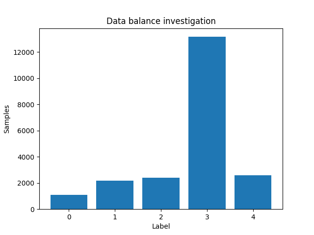
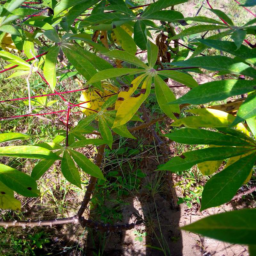
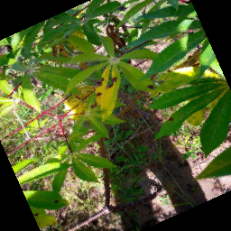
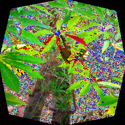
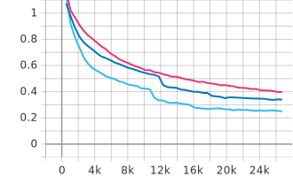
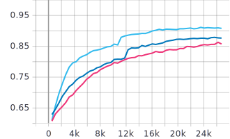
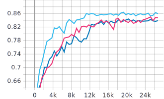
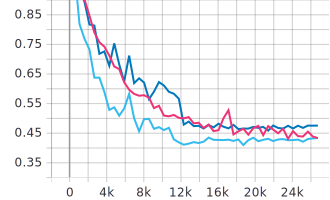
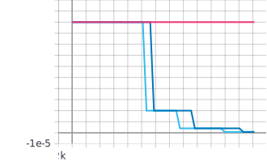

- [Introduction](#introduction)
  - [Project overview](#project-overview)
  - [Included files and directories](#included-files-and-directories)
- [Data](#data)
  - [Data sources](#data-sources)
  - [Data preview](#data-preview)
  - [Data balance investigation](#data-balance-investigation)
  - [Augmentations](#augmentations)
- [Model architectures](#model-architectures)
  - [VGG-16](#vgg-16)
  - [ResNet-50](#resnet-50)
  - [EfficientNet-B4](#efficientnet-b4)
- [Metrics](#metrics)
  - [Average Training Loss](#average-training-loss)
  - [Average Training Accuracy](#average-training-accuracy)
  - [Average Validation Loss](#average-validation-loss)
  - [Average Validation Accuracy](#average-validation-accuracy)
  - [Learning Rate Curve](#learning-rate-curve)
- [Concluding notes](#concluding-notes)
  - [Possible further improvements](#possible-further-improvements)
  - [Citations](#citations)

# Introduction
## Project overview
A from-scratch implementation and comparison of state-of-the-art (SOTA) Convolutional Neural Network (CNN) architectures on the problem of identifying diseases on Cassava leaves. My goal with this project is to implement these top-performing architectures from scratch to classify the disease/condition of cassava plants, and to learn why these architectures were able to achieve SOTA.

The problem description (as found on the [Kaggle competition page](https://www.kaggle.com/c/cassava-leaf-disease-classification/overview)) is as follows:

> As the second-largest provider of carbohydrates in Africa, cassava is a key food security crop grown by smallholder farmers because it can withstand harsh conditions. At least 80% of household farms in Sub-Saharan Africa grow this starchy root, but viral diseases are major sources of poor yields. With the help of data science, it may be possible to identify common diseases so they can be treated.
>
> Existing methods of disease detection require farmers to solicit the help of government-funded agricultural experts to visually inspect and diagnose the plants. This suffers from being labor-intensive, low-supply and costly. As an added challenge, effective solutions for farmers must perform well under significant constraints, since African farmers may only have access to mobile-quality cameras with low-bandwidth.
>
> In this competition, we introduce a dataset of 21,367 labeled images collected during a regular survey in Uganda. Most images were crowdsourced from farmers taking photos of their gardens, and annotated by experts at the National Crops Resources Research Institute (NaCRRI) in collaboration with the AI lab at Makerere University, Kampala. This is in a format that most realistically represents what farmers would need to diagnose in real life.
>
> Your task is to classify each cassava image into four disease categories or a fifth category indicating a healthy leaf. With your help, farmers may be able to quickly identify diseased plants, potentially saving their crops before they inflict irreparable damage.

## Included files and directories
* `sort_images.py`: Script used to sort data into labeled directories.
* `sample_images`: Directory showing the structure of the sorted directory with 1 sample per label.
* `plots`: Directory storing the plots used in this document. 
* `data_module.py`: Script that imports the data for use with the model. Uses the `DataModule` class from `pytorch-lightning`.
* `main.py`: Script that executes model training for a selected network. Also includes a flag to trigger a hyperparameter search using [Population-Based-Training](https://deepmind.com/blog/article/population-based-training-neural-networks) (implementation from the package `ray[tune]`.
* `vgg16.py`: From-scratch implementation of VGG-16.
* `resnet50.py`: From-scratch implementation of the ResNet family of networks. Currently set to build ResNet-50, but can be configured to implement any ResNet variant.
* `efficientnetb4.py`: From-scratch implementation of the EfficientNet family of networks. Currently set to build EfficientNet-B4, but can be configured to implement any EfficientNet variant.

# Data
## Data sources
The data was contributed by the Makerere Artificial Intelligence (AI) Lab, an AI and Data Science research group based at Makerere University in Uganda. Using the [Kaggle API](https://github.com/Kaggle/kaggle-api), the data can be downloaded for local use:

    kaggle competitions download -c cassava-leaf-disease-classification

This project only uses the 2020 version of the dataset, but some report achieving better results by also incorporating the 2019 version. The 2019 version can also can be downloaded for local use:

    kaggle competitions download -c cassava-disease

## Data preview
Every image is a `.jpg` and can have a label from 0 to 4. The label mapping is as follows:
* "0": Cassava Bacterial Blight (CBB)
* "1": Cassava Brown Streak Disease (CBSD)
* "2": Cassava Green Mottle (CGM)
* "3": Cassava Mosaic Disease (CMD)
* "4": Healthy

A preview of the dataset is available in `sample_images`:

|                           0                           |                 1                  |                  2                  |                 3                  |                 4                  |
| :---------------------------------------------------: | :--------------------------------: | :---------------------------------: | :--------------------------------: | :--------------------------------: |
|  |  |  |  |  |

Some additional notes about the data:
* The data is provably noisy, with multiple observed duplicates and labeling inconsistencies.
* Label quality may vary due to the subjective decisions of different labelers on deciding how diseased a leaf must be to be considered sick.
* The test set on Kaggle itself is noisy, and has brought about concerns with regards to the actual real-world impact of the original competition. As a result, I will only be reporting validation scores.

## Data balance investigation
The distribution of the number of samples per label is as follows:
* "0": 1084
* "1": 2189
* "2": 2386
* "3": 13158
* "4": 2577

Note: The data may seem imbalanced at first glance, but implementing class weights actually degraded performance. From this we can conclude that the imbalance is not substantial enough to warrant manual weight rebalancing.

## Augmentations
The data was augmented before being sent to the network to improve robustness. This was done using transforms from the library `torchvision`. The augments used are as follows:
1. Image resize to 256x256
2. Random horizontal flip with a probability of 0.2
3. Random vertical flip with a probability of 0.2
4. Random rotation of up to 30 degrees
5. Normalization with a mean and std of 0.5 across all channels

Sample augmentation of an image:
| Transform | Image |
| --------- | ----- |
| Image resize (256x256) |  | 
| Horizontal flip (p=0.2) |  |
| Vertical flip (p=0.2) |  |
| Rotation (degrees<=30) |  |
| Normalization (mean=[0.5, 0.5, 0.5], std=[0.5, 0.5, 0.5]) |  |

# Model architectures
This section includes an outline of each architecture and their implementations. Some details to keep in mind while reading:
* `CrossEntropyLoss` is used as the loss function for each network.
* `Adam` is used as the optimizer for each network.
* `ReduceLROnPlateau` is used as a learning rate scheduler for each network (starting point of 1e-4, patience of 5 epochs, monitors `val_loss_epoch`).
* Each model is trained on single GPU (Nvidia GTX 1080 Ti), but can be scaled with ease.

Note: Models were initially built with `EarlyStopping` but showed much better performance gains after switching to learning rate schedulers instead.

## VGG-16
The VGG family of networks was proposed by K. Simonyan and A. Zisserman from the University of Oxford in the paper "Very Deep Convolutional Networks for Large-Scale Image Recognition." The model achieves 92.7% top-5 test accuracy on ImageNet (a dataset of over 14 million images belonging to 1000 classes). The paper demonstrated that it is possible to achieve SOTA performance simply using a conventional CNN architecture with substantially increased depth. 

|  | 
|:--:| 
| *The configurations of each VGG variant as proposed in the original paper.* |

For our use case, the number of classes has been changed to 5 (corresponding to the number of possible disease labels). I opted to use configuration D with 16 layers as a trade-off between performance and computation time.

|  | 
|:--:| 
| *The architecture of VGG-16.* |

The model is quite large with over 750 million parameters but is relatively simple to implement.

## ResNet-50
The ResNet family of networks was proposed by Kaiming He et al. in the paper "Deep Residual Learning for Image Recognition." The paper aimed to solve the problem of the vanishing gradient that tanks performance when trying to create very deep neural networks to map higher level image features. It does this by introducing the concept of a "skip connection", which allows gradients to flow directly backwards from later layers to initial filters. The skip connection allows the creation of well-performing high-depth networks, and in this way it was able to achieve SOTA.
|  | 
|:--:| 
| *Architecture of ResNet-34 with a comparison to VGG-19* |

Once again, the number of classes in our case has been changed to 5 (ResNet was also trained on ImageNet). The version implemented here is ResNet-50, the configuration with 50 layers.
|  | 
|:--:| 
| *Resnet architectures.* |

## EfficientNet-B4
The EfficientNet family of networks was proposed by Mingxing Tan et al. in the paper "EfficientNet: Rethinking Model Scaling for Convolutional Neural Networks." The paper introduces a scaling method called the "compound coefficient" to uniformly scale the depth/width/resolution of neural network models, unlike conventional practice that arbitrarily scales these factors. The compound scaling method is justified by the intuition that if the input image is bigger, then the network needs more layers to increase the receptive field and more channels to capture more fine-grained patterns on the bigger image.

|  | 
|:--:| 
| *Concept of model scaling.* |

The EfficientNet family are networks built based on this compound coefficient. The version implemented here is EfficientNet-B4.

|  | 
|:--:| 
| *EfficientNet-B0 baseline network.* |

|  | 
|:--:| 
| *Scaling factor for other EfficientNets.* |

# Metrics
This section includes a report on each model's peformance on the train set and validation sets. Some details to keep in mind while reading through:
* The validation set is defined as a random slice that contains 20% of the train set.
* Loss refers to the aforementioned Cross Entropy Loss of the model.
* Each network was trained for 50 epochs.
* Initial learning rate for each network was 1e-4.
* Batch size for each network was 32.
* Pink: EfficientNet, Blue: ResNet, Cyan: VGG.
 
## Average Training Loss

## Average Training Accuracy

## Average Validation Loss

## Average Validation Accuracy

## Learning Rate Curve

# Concluding notes
Somewhat surprisingly, VGG-16 takes the crown across all metrics. The likely explanation is the number of epochs- with a greater number of epochs the deeper networks should be able to show better perfomance. EfficientNet did not even approach a loss plateau to warrant an adjustment in its learning rate.

It is worth noting that the three models show similar performance, which might tell us something about the label noise or quality of images.

Better results have been achieved by others on this dataset, but most popular solutions incorporate a pretrained MobileNet from MakAI that has possibly already seen the test set, which wouldn't be a fair comparison. With that being said, there is always room for improvement.

## Possible further improvements
Improvements that I thought about implementing but couldn't due to time constraints.
* Auto-augmentation instead of a manual definition of augments to use.
* Testing with different learning rate schedulers.
* Testing with different loss functions.
* Testing with different optimizers.
* Testing with different image sizes.
* Implementation and optimization of L2 regularized weight decay values.
* Using pretrained weights from ImageNet instead of training from scratch

## Citations
* Falcon, WA et al. "PyTorch Lightning". GitHub. (2019).
* Liaw, Richard et al. "Tune: A Research Platform for Distributed Model Selection and Training". (2018).
* Karen Simonyan, et al. "Very Deep Convolutional Networks for Large-Scale Image Recognition." (2015).
* Kaiming He, et al. "Deep Residual Learning for Image Recognition." (2015).
* Mingxing Tan, et al. "EfficientNet: Rethinking Model Scaling for Convolutional Neural Networks." (2020).

